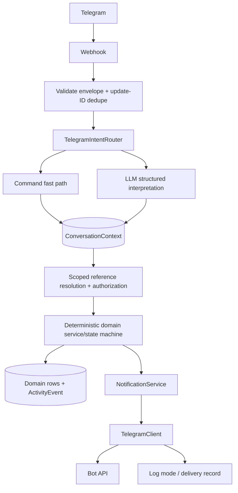
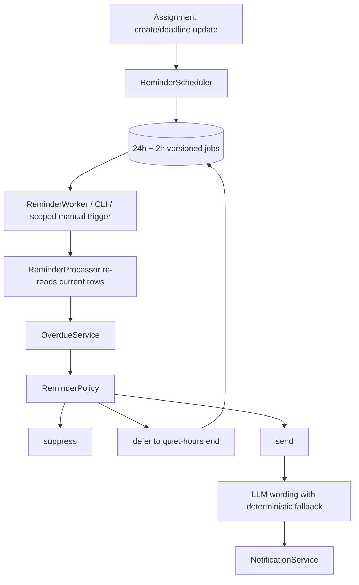

# Architecture

## Boundaries

- `app/web/auth.py`, `teacher.py`, `student.py`, `coordinator.py`, and `files.py` own HTTP/session/form concerns; `helpers.py` holds shared request helpers.
- `app/telegram/service.py` validates and deduplicates update envelopes; `router.py` handles conversational intent; `conversation.py` persists short-lived context; `files.py` confines downloads; `client.py` is the Bot API boundary.
- `app/services` owns authorization, classes/invites, assignment mutations, reference resolution, progress, submissions/feedback, notifications, overdue transitions, risk scoring, and the state machine.
- `app/reminders/scheduler.py` creates durable versioned jobs, `processor.py` re-reads state and executes them, `policy.py` chooses deterministic actions, and `worker.py` polls safely.
- `app/llm` defines Pydantic schemas, a provider interface, a current OpenAI Responses implementation, a deterministic test/demo implementation, and interaction logging/error containment.
- `app/models.py` and `app/database.py` own the relational model, foreign keys, constraints, WAL, and transaction primitives.

Transport handlers never authorize from user-supplied IDs. They first resolve an authenticated actor, restrict candidate queries to that actor’s server-side memberships, then call a domain service. SQLAlchemy sessions are caller-owned so related rows commit or roll back together.

## Telegram flow

Unknown senders can use only help and `/join CODE EMAIL`. Callback buttons are translated into the same command path; they do not mutate state directly. Ambiguous references produce choices. A 30-minute context can hold an active assignment or pending file submission, but it is always re-authorized when consumed.

Primary student onboarding uses `TelegramLinkService`: an authorized teacher/coordinator creates a high-entropy token for an existing class student, only its SHA-256 digest is persisted, and a private `/start TOKEN` atomically validates membership/conflicts, saves numeric Telegram identifiers, and consumes the token. Regeneration revokes earlier unused tokens. `/join CODE EMAIL` remains a fallback. Neither path treats Telegram names or usernames as identity.

## Reminder flow

The database, not memory, is the durable queue. A deadline edit increments `Assignment.schedule_version`, cancels pending/deferred jobs from prior versions, and adds new 24-hour and 2-hour jobs with versioned unique keys. Processing cancels stale versions, transitions eligible states to overdue before policy evaluation, never sends during school-local quiet hours, suppresses cancelled/submitted/completed work, and frequency-limits blocker follow-ups.

The background worker passes no scope and is the system-wide actor. Web callers calculate authorized class IDs from memberships and pass that set into the same processor. A user-supplied class ID is never used as reminder authority.

## Notification lifecycle

`NotificationService` is the only assignment-related message boundary. Creation, deadline changes, instruction clarification, cancellation, feedback, and reminders all persist `NotificationDelivery` with `school_id`, `classroom_id`, `assignment_id`, recipient, status, body, idempotency key, attempts, and errors. An unlinked student is `skipped`; log mode is `logged`; real Bot API success is `sent`; failures are `failed` and receive bounded 1/5/15-minute retries.

Teacher delivery queries are restricted to assigned class IDs; coordinators may also see school-scoped deliveries for their coordinator schools. External failure does not invalidate a correct domain mutation. The single-process take-home records the intent and failure in the same application transaction; production should use a transactional outbox so a crash between commit and delivery is recoverable without ambiguity.

## File flow

Telegram document/photo -> `getFile` -> authenticated Bot API download -> streamed size check -> UUID filename under resolved `UPLOAD_DIR` -> SHA-256 hash -> idempotent `Submission`. The original filename is metadata only. Browser uploads use the same path-confinement and byte limit principles.

Files are not mounted as public static data. `GET /submissions/{id}/file` loads the stored path only after teacher-class or student-owner authorization, verifies the resolved path remains below `UPLOAD_DIR`, and returns 404 for absent/out-of-root files. Images are served inline for previews; other files are attachments.

## Transactions and idempotency

- Assignment creation: assignment, targets, independent states, two jobs per student, activity, operation key, and contextual delivery rows.
- Deadline update: aware future-time validation, version increment, prior-job cancellation, replacements, activity, operation key, and student deliveries.
- Submission: authorized assignment, unique transport/form key, content hash, state transition, and activity.
- Feedback: unique form key, feedback, review transition, activity, and delivery.
- Telegram: unique update ID plus result reference; duplicate callbacks/messages exit before dispatch.
- Telegram linking: unique token digest, row lock where supported, expiry/revocation/use checks, Telegram uniqueness, explicit disconnect before account replacement, and one transaction for link plus consumption.

Database uniqueness protects update IDs, operation keys, targets/states, submissions, feedback keys, reminder keys, delivery keys, memberships, and conversation `(user_id, chat_id)`.

## LLM safety boundary

The model may classify intent, extract human references and relative deadlines, parse progress, summarize already-authorized risk items, and phrase a policy-approved reminder. It may not select database IDs, authorize, execute SQL, create memberships, mutate state, bypass transitions, or send messages. Pydantic schemas, aware-time validation, a confidence threshold, scoped reference resolution, and domain services contain bad output. Every model operation records success or an error type without API keys.

## Deployment shape

The take-home is intentionally one FastAPI process, SQLite/WAL, a polling task, and local files. Production uses PostgreSQL + Alembic, an outbox, a durable queue, distributed workers with leases, object storage/malware scanning, managed identity, rate limits, secret management, and centralized logs/metrics/traces.
