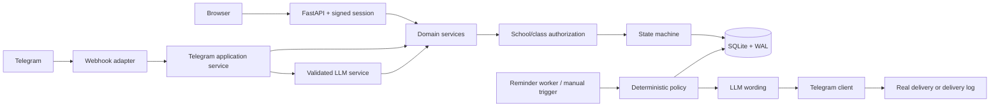
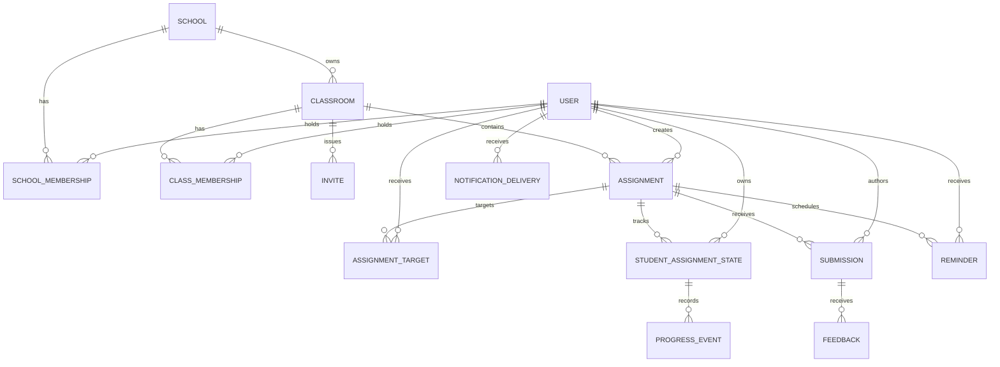
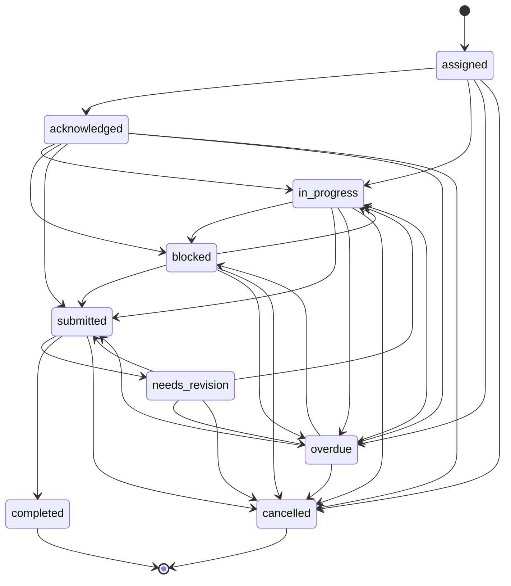

# Classroom Companion

Classroom Companion is a production-minded, Telegram-first assignment coordination system for a small school pilot. Teachers create work in natural language, students acknowledge, report progress or blockers, submit text/files, and receive feedback. A server-rendered web UI provides a calm operational view; SQLite persists every state change, delivery, LLM interaction, and idempotency record.

The implemented vertical slice covers the complete interview demo: assign -> change deadline -> differentiated reminders -> progress/blocker -> submit -> feedback -> teacher/student UI, including rejected wrong-context access.

## Features

- Class-scoped teacher and school-scoped coordinator authorization; students see only their records.
- Signed, HTTP-only sessions; PBKDF2-HMAC passwords; CSRF tokens on state-changing web forms.
- Natural-language assignment and progress interpretation through the official OpenAI SDK with validated Pydantic structured output.
- Deterministic `LLM_MODE=fake` for tests and local demos; this mode is explicitly not the production language-understanding implementation.
- Telegram webhook commands, callback-compatible acknowledgements, text/document/photo submissions, account linking, feedback delivery, and retry idempotency.
- Central student-assignment state machine with invalid-transition rejection.
- Blocked, silent, due-soon, and overdue reminder policies with anti-spam dedupe and completed/submitted suppression.
- Teacher dashboard, class/assignment detail, risk view, delivery log, manual reminder button, review and feedback.
- Student dashboard, assignment detail, progress/blocker updates, file/text submissions, and feedback history.
- SQLite foreign keys, WAL, useful indexes/uniqueness constraints, short transactions, activity logs, and restart-safe reminder records.
- 16 deterministic automated tests; external APIs are never called in tests.

## Technology choices

Python 3.12+, FastAPI, SQLAlchemy 2.x, Pydantic Settings, Jinja2, vanilla CSS, SQLite, HTTPX, the official OpenAI Python SDK, ItsDangerous, and pytest. There is no Node build, Redis, Celery, PostgreSQL, or Docker requirement.

## Architecture

Transport adapters contain request/response concerns and delegate to shared services. LLM output is treated as untrusted input; deterministic authorization and state validation always run after interpretation and before mutation.



Detailed flows are in [ARCHITECTURE.md](ARCHITECTURE.md); ambiguous product decisions are in [REASONING.md](REASONING.md).

## Domain model

Roles are memberships, not flags. A user can have multiple school roles and different class roles. Assignment lifecycle is separate from each targeted student's state.



The database also includes processed Telegram updates, generic idempotency keys, activity events, LLM interactions, and notification delivery records. Services verify cross-school/class consistency before creating relationships.

## Assignment state model

`Assignment.status` controls the shared lifecycle (`draft`, `assigned`, `cancelled`). `StudentAssignmentState.status` tracks each target independently:



Submissions safely advance `assigned/acknowledged -> in_progress -> submitted` in one transaction. Feedback advances `submitted -> needs_revision|completed`.

## Authorization and identity

- Coordinator: resources in schools with a coordinator membership.
- Teacher: only classes with a teacher class membership (plus coordinator scope when the person holds both roles).
- Student: only targeted assignments, state, submissions, reminders, and feedback whose `student_id` is their authenticated ID.
- Wrong-context access returns a non-leaking 403/404. IDs supplied by forms or paths never grant access.
- Telegram IDs identify a linked account; display names and usernames are never trusted.
- `/join CODE EMAIL` links a pre-created student record after validating invite state, school boundary, Telegram uniqueness, expiry, and use limit. The email makes identity explicit when names/handles differ. An unlinked sender receives instructions instead of access.

## Reminder policy

For each active student state, deterministic code chooses exactly one action per UTC day:

1. completed, submitted, or cancelled -> suppress;
2. blocked -> supportive blocker follow-up and teacher-visible risk;
3. no activity -> silent check-in asking for progress or a blocker;
4. deadline passed -> overdue reminder;
5. otherwise -> due-soon reminder.

Deadline changes cancel pending schedule rows and create replacements. Dedupe keys prevent repeated manual/background runs from spamming. `REMINDER_INTERVAL_SECONDS` controls the in-process worker; `0` disables it. Quiet-hour fields are configured and documented for the production migration, but this take-home worker does not defer delivery by quiet hours.

## LLM boundary and failure handling

The model may classify intent, extract title/instructions/deadline, interpret progress, summarize facts, and phrase reminders. It cannot select database IDs, authorize, execute SQL, create membership, write directly to the database, choose transitions, or send outside deterministic policy.

Real mode uses `OpenAI.responses.parse` with Pydantic output schemas. Every date is required to be timezone-aware and confidence must be at least 0.7. Malformed, empty, or low-confidence output creates an observable failed interaction and asks for clarification without creating an assignment. Telegram errors are logged and recorded; database errors roll back the transaction; unsafe filenames are discarded, uploads are UUID-named, size-limited, and confined to `UPLOAD_DIR`.

## Idempotency

- `ProcessedTelegramUpdate.telegram_update_id` is unique; a retry returns `duplicate=true` before dispatch.
- Submissions have a unique transport/form idempotency key.
- Assignment creation stores a unique operation key and result reference, so a double click returns the original assignment.
- Reminder keys include policy, assignment, student, and day; deadline schedules include the deadline version.
- Telegram side effects and the processed marker share a transaction in log/demo mode. In a larger system, delivery would use a transactional outbox.

## Setup

PowerShell commands from a clean checkout:

```powershell
py -3.12 -m venv .venv
.\.venv\Scripts\Activate.ps1
python -m pip install -e ".[dev]"
Copy-Item .env.example .env
python -m scripts.seed
python -m uvicorn app.main:app --reload
```

Open <http://127.0.0.1:8000>. Tables are created automatically on startup; `python -m scripts.seed` adds the reproducible demo. The seed is idempotent.

macOS/Linux equivalents use `python3.12 -m venv .venv`, `source .venv/bin/activate`, and `cp .env.example .env`.

## Environment variables

| Variable | Purpose | Demo default |
|---|---|---|
| `DATABASE_URL` | SQLAlchemy URL | `sqlite:///./classroom_companion.db` |
| `SESSION_SECRET` | Session signing secret; replace outside local demo | development placeholder |
| `BASE_URL` | Public base URL for Telegram webhook | local URL |
| `SCHOOL_TIMEZONE` | Default provisioning timezone | `Asia/Kolkata` |
| `LLM_MODE` | `real` or deterministic `fake` | `fake` |
| `OPENAI_API_KEY` | Required only in real LLM mode | blank |
| `OPENAI_MODEL` | Responses API model | `gpt-5-mini` |
| `TELEGRAM_MODE` | `real` or `log` | `log` |
| `TELEGRAM_BOT_TOKEN` | Required only in real Telegram mode | blank |
| `TELEGRAM_WEBHOOK_SECRET` | Unpredictable webhook path component | local placeholder |
| `UPLOAD_DIR` / `MAX_UPLOAD_BYTES` | Upload confinement and limit | `uploads` / 10 MiB |
| `REMINDER_INTERVAL_SECONDS` | Background worker interval; 0 disables | 300 |
| `QUIET_HOUR_START/END` | Policy configuration for production extension | 21 / 7 |

For a real language demo, set `LLM_MODE=real`, `OPENAI_API_KEY`, and an available `OPENAI_MODEL`. For real Telegram, set `TELEGRAM_MODE=real`, a token, secret, and public HTTPS `BASE_URL`.

## Telegram setup and commands

Expose port 8000 using any HTTPS tunnel, set `BASE_URL`, then register the webhook:

```powershell
python -m scripts.set_telegram_webhook
```

The resulting endpoint is `POST /telegram/webhook/{TELEGRAM_WEBHOOK_SECRET}`. Telegram commands:

- `/join SIM8SCI student2@sim.school`
- `/assign 1 Complete the energy worksheet by next Friday at 6 PM`
- `/ack 1`
- `/progress 1 I have finished 60%`
- `/blocked 1 I cannot open the source file`
- `/submit 1 My written answer` (or attach a document/photo with `/submit 1` as caption)
- `/status` and `/help`

## Running, tests, reminders, and lint

```powershell
python -m uvicorn app.main:app --reload
python -m pytest -q
python -m ruff check app scripts tests
python -m scripts.run_reminders
```

Teachers can also click **Run reminder processing now**. Important operations include a request/update ID in logs; activity, model interaction, reminder, and delivery records remain queryable.

## Demo accounts

All seeded web accounts use password `DemoPass123!`:

| Account | Email | Notes |
|---|---|---|
| Teacher | `teacher@sim.school` | Authorized for Grade 8 Science; Telegram-linked |
| Student 1 | `student1@sim.school` | Telegram-linked; seeded in progress |
| Student 2 | `student2@sim.school` | Intentionally unlinked and silent |
| Coordinator | `coordinator@sim.school` | School-level access |
| Unrelated teacher | `teacher@northstar.school` | Separate school; useful for access checks |

See [DEMO.md](DEMO.md) for exact end-to-end steps.

## Known limitations and production path

This take-home intentionally uses SQLite, an in-process reminder loop, server-rendered UI, webhook Telegram integration, local file storage, and simple signed sessions. SQLite is safe here with foreign keys, WAL, short transactions, and uniqueness constraints, but it is not distributed locking and this worker must run in only one application replica.

For a larger deployment: migrate to PostgreSQL; use a transactional outbox plus durable queue and distributed workers; put uploads in object storage with malware scanning; add OpenTelemetry/metrics and structured log aggregation; use a secret manager, rate limiting, retry/dead-letter policies, production identity provider, school provisioning/admin tools, and database migrations. Telegram file download is represented and deduplicated by file ID in this slice; downloading binary Telegram content into object storage is the next file-pipeline step. Quiet-hour deferral, assignment groups, invite revocation UI, pagination, and richer coordinator management are also next steps.

## Key product trade-offs

- Depth over breadth: the minimum live scenario and access boundaries are executable; enterprise administration is not built.
- Real OpenAI adapter plus deterministic demo adapter: reviewers can run offline while the production language boundary remains real and testable.
- Explicit `/join CODE EMAIL`: safer than guessing identity from a Telegram display name.
- Server-rendered pages: quick to audit, accessible, and sufficient for light operations.
- Delivery log mode: exercises persistence/policy without pretending a bot token exists.

