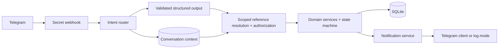
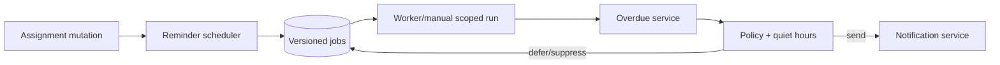

# Classroom Companion

Classroom Companion is a Telegram-first, multi-school assignment workflow built with FastAPI, SQLAlchemy, SQLite, Jinja, and the OpenAI Responses API. Teachers can assign and revise work conversationally, students can acknowledge, report progress or blockers, submit text/files, and receive feedback, while the web UI exposes authorized operational views.

The implementation preserves a strict boundary: the language model interprets text and writes short summaries; deterministic services resolve authorized records, validate transitions, mutate data, schedule jobs, and send notifications.

## What works

- School roles and class memberships support coordinators, teachers in several classes, shared teachers, and class-scoped students.
- Teachers can create classes, pre-create students, generate/disable expiring invite codes, and inspect onboarding state without editing the database.
- Natural-language Telegram flows cover assignment creation, deadline changes, instruction clarification, cancellation, class/risk summaries, acknowledgement, progress, blockers, help, and text submission.
- Commands remain available as deterministic fallbacks: `/join`, `/assign`, `/ack`, `/progress`, `/blocked`, `/submit`, `/status`, and `/help`.
- Conversation context is persisted for 30 minutes, enabling “Move it to Friday” and a photo arriving after “Here’s my homework.” Ambiguous or expired context asks the user to choose instead of guessing.
- Assignment creation, deadline edits, clarification, cancellation, reminders, and feedback use one contextual notification service. Unlinked students produce an explicit `skipped` delivery.
- Reminder jobs are persisted at 24 hours and 2 hours before each deadline. Deadline edits increment `schedule_version`, cancel prior pending jobs, and create replacement jobs.
- Reminder processing re-reads live assignment/state data, marks eligible states overdue, suppresses final states, distinguishes blocked/silent/active work, and defers every reminder during school-local quiet hours (22:00-07:00 by default).
- Manual reminder processing is limited to class IDs calculated from the authenticated teacher/coordinator’s server-side memberships. The system worker and CLI can process all classes.
- Telegram `getFile` and file download are implemented with size limits, UUID storage names, hashes, timeouts, and authorized file-serving routes. Image submissions render as teacher previews.
- Telegram assignment messages include acknowledge, blocked, and submit/help buttons. Update IDs, submissions, assignment operations, feedback, notification deliveries, and reminder jobs are idempotent.
- Delivery failures are persisted and retried at bounded 1/5/15-minute intervals. A valid business mutation is not rolled back solely because Telegram is unavailable.
- Signed HTTP-only sessions, PBKDF2 password hashing, CSRF forms, scoped database queries, safe paths, and non-leaking authorization errors protect the web surface.
- GitHub Actions runs Ruff and pytest on push and pull requests. The existing Pages workflow is unchanged.

## Architecture





See [ARCHITECTURE.md](ARCHITECTURE.md) for boundaries and [REASONING.md](REASONING.md) for product decisions.

## Setup

```powershell
py -3.12 -m venv .venv
.\.venv\Scripts\Activate.ps1
python -m pip install -e ".[dev]"
Copy-Item .env.example .env
python -m scripts.seed
python -m uvicorn app.main:app --reload
```

Open <http://127.0.0.1:8000>. `python -m scripts.seed` is idempotent. This project uses `create_all` for take-home simplicity; after model changes, remove the disposable local demo database and reseed. Production must use Alembic migrations.

## Environment

| Variable | Purpose | Default |
|---|---|---|
| `DATABASE_URL` | SQLAlchemy database URL | `sqlite:///./classroom_companion.db` |
| `SESSION_SECRET` | Session signing secret | development placeholder |
| `BASE_URL` | Public HTTPS base for Telegram | local URL |
| `SCHOOL_TIMEZONE` | Provisioning default | `Asia/Kolkata` |
| `LLM_MODE` | `fake` for tests/offline or `real` | `fake` |
| `OPENAI_API_KEY` | Required in real LLM mode | blank |
| `OPENAI_MODEL` | Responses API model | `gpt-5-mini` |
| `TELEGRAM_MODE` | `log` or `real` | `log` |
| `TELEGRAM_BOT_TOKEN` | Required in real Telegram mode | blank |
| `TELEGRAM_WEBHOOK_SECRET` | Unpredictable webhook path segment | local placeholder |
| `UPLOAD_DIR` / `MAX_UPLOAD_BYTES` | Confined storage and byte limit | `uploads` / 10 MiB |
| `QUIET_HOUR_START/END` | School-local no-send window | `22` / `7` |
| `REMINDER_INTERVAL_SECONDS` | Worker interval; `0` disables | `300` |
| `CONVERSATION_CONTEXT_MINUTES` | Context expiry | `30` |
| `NOTIFICATION_MAX_ATTEMPTS` | Bounded delivery attempts | `3` |

## Real OpenAI mode

Set `LLM_MODE=real`, `OPENAI_API_KEY`, and an available `OPENAI_MODEL`, then restart. The adapter uses the installed official SDK’s `client.responses.parse(..., text_format=PydanticModel)` API for structured assignment, teacher-intent, student-intent, progress, and risk output, plus `responses.create` for reminder wording. Provider output is schema-validated, confidence-gated, logged without secrets, and never receives authority to query or mutate the database.

## Real Telegram mode

Create a bot with BotFather, set `TELEGRAM_MODE=real` and `TELEGRAM_BOT_TOKEN`, expose port 8000 through a public HTTPS tunnel, set `BASE_URL` and a long random `TELEGRAM_WEBHOOK_SECRET`, then run:

```powershell
python -m scripts.set_telegram_webhook
```

The endpoint is `POST /telegram/webhook/{TELEGRAM_WEBHOOK_SECRET}`. Link a pre-created student with `/join CODE EMAIL`. Display names and Telegram usernames are never treated as school identity.

## Verification

```powershell
python -m ruff check app scripts tests
python -m pytest -q
python -m scripts.run_reminders
```

Use [DEMO.md](DEMO.md) for the full interview runbook.

## Demo accounts

All seeded accounts use `DemoPass123!`:

| Role | Email |
|---|---|
| Teacher | `teacher@sim.school` |
| Linked student | `student1@sim.school` |
| Unlinked/silent student | `student2@sim.school` |
| Coordinator | `coordinator@sim.school` |
| Unrelated teacher | `teacher@northstar.school` |

The seeded invite is `SIM8SCI`.

## Known limitations and production path

The take-home intentionally runs one process with SQLite, local uploads, an in-process polling worker, basic sessions, and lightweight onboarding. Log-mode Telegram cannot download a real Telegram file because no Bot API is available; use a normal web upload for offline demos or real mode for Telegram photos. Natural-language quality in real mode depends on the configured model; fake mode is deterministic test/demo scaffolding and is not presented as the required LLM capability.

For production, migrate to PostgreSQL with Alembic, move notification intent to a transactional outbox and durable queue, use distributed/idempotent workers, store uploads in scanned object storage, add managed identity and rate limiting, rotate secrets through a secret manager, and add structured telemetry, alerting, pagination, retention controls, and dead-letter operations.
